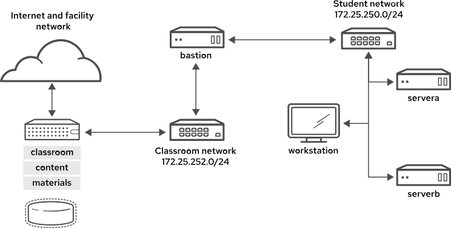
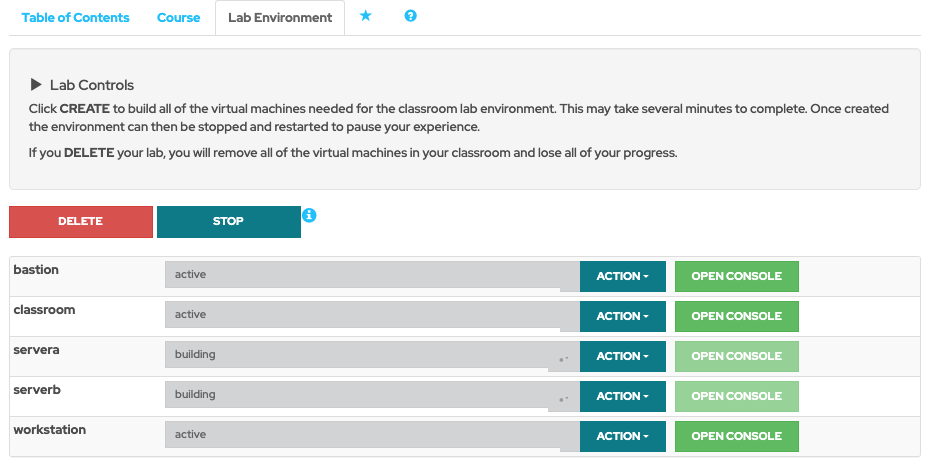

### Introduction
`Red Hat System Administration I (RH124)` предназначен для ИТ-специалистов без опыта системного администрирования Linux. Курс дает студентам `навыки выживания` в администрировании Linux, уделяя особое внимание основным задачам администрирования. 
`Red Hat System Administration I` также предоставляет основу для студентов, которые планируют стать штатными системными администраторами Linux, знакомя с ключевыми концепциями командной строки и инструментами корпоративного уровня.

1. Цели курса:
- Вы получите достаточные навыки для выполнения основных задач системного администрирования в `Red Hat Enterprise Linux`.
- Вы получите базовые навыки, необходимые системному администратору `Red Hat Enterprise Linux`, сертифицированному `RHCSA`.

2. Аудитория ИТ-специалистов широкого спектра дисциплин, которым необходимо выполнять основные задачи администрирования Linux, включая установку, установление сетевого подключения, управление физическим хранилищем и базовое администрирование безопасности.

3. Предварительные требования Этот курс не имеет формальных предварительных условий; однако предыдущий опыт системного администрирования в других операционных системах будет полезен.



В этом курсе основной компьютерной системой для практических занятий является рабочая станция. Для этой деятельности учащиеся также используют еще две машины: `servera` и `serverb`. Все три системы находятся в DNS-домене `lab.example.com`.

Все студенческие компьютерные системы имеют стандартную учетную запись пользователя `student`, которая имеет пароль `студент`. Пароль root во всех студенческих системах — `redhat`.

- Linux username - `student`
- Linux root-pswd - `redhat`

Список виртуальных машин:
1. `bastion.lab.example.com` (172.25.250.254) - Система шлюза для подключения частной сети ученика к серверу класса (должна быть всегда включена)
2. `classroom.example.com` (172.25.254.254) - Сервер, на котором размещены необходимые учебные материалы
3. `workstation.lab.example.com` (172.25.250.9) - Графическая рабочая станция для студентов
4. `servera.lab.example.com	` (172.25.250.10) - управляемый сервер A
5. `serverb.lab.example.com	` (172.25.250.11) - управляемый сервер B

Основная функция `bastion.lab.example.com` — выступать в качестве маршрутизатора между сетью, соединяющей компьютеры учащихся, и сетью класса. 
Если `bastion.lab.example.com` не работает, другие компьютеры учащихся смогут получить доступ только к системам в сети отдельного ученика.

Несколько систем в классе предоставляют вспомогательные услуги. Два сервера, `content.example.com` и `Material.example.com`, являются источниками программного обеспечения и лабораторных материалов для практических занятий. 

Информация о том, как использовать эти серверы, представлена в инструкциях к этим действиям. Эти действия выполняются виртуальной машиной рабочей станции. И `classroom`, и `bastion.lab.example.com` должны всегда работать для правильного использования лабораторной среды.

```bash
[student@workstation ~]$ ssh student@serverb
Warning: Permanently added 'serverb,172.25.250.11' (ECDSA) to the list of known hosts.
Activate the web console with: systemctl enable --now cockpit.socket

[student@serverb ~]$
```

Управление виртуальными машинами в вашей классной среде осуществляется с помощью элементов управления интерфейса веб-страницы. Состояние каждой виртуальной машины класса отображается на вкладке «Лабораторная среда».



Состояния виртуальных машин:
1. `building` - ВМ создана
2. `active` - ВМ доступна для запуска, если ВМ только что запустилась, она все еще может запускать службы.
3. `stopped` - ВМ полностью выключена. При запуске виртуальная машина загружается в то же состояние, в котором она находилась до завершения работы. Состояние диска сохраняется.

Действия в учебном классе:
1. `CREATE` - Создает `ROLE`-classroom. Создает и запускает все виртуальные машины, необходимые для этого класса. Создание может занять несколько минут.
2. `CREATING` - Виртуальные машины класса `ROLE` создаются. Создает и запускает все виртуальные машины, необходимые для этого класса. Создание может занять несколько минут.
3. `DELETE` - Удалить `ROLE`-classroom. Уничтожает все виртуальные машины в классе. Вся сохраненная работа на дисках этих систем будет потеряна.
4. `START` - Запускает все виртуальные машины `ROLE`-classroom.
5. `STOP` - Останавливает все виртуальные машины в `ROLE`-classroom.

Действия с ВМ:
1. `OPEN CONSOLE` - Подключитесь к системной консоли виртуальной машины в новой вкладке браузера. Вы можете войти непосредственно в виртуальную машину и при необходимости запускать команды. Обычно войдите только в виртуальную машину рабочей станции и оттуда используйте ssh для подключения к другим виртуальным машинам.
2. `ACTION -> start` - Запустите (включите) виртуальную машину.
3. `ACTION -> shutdown` - Корректно выключите виртуальную машину, сохранив содержимое диска.
4. `ACTION -> power off` - Принудительно выключите виртуальную машину, сохранив при этом содержимое диска. Это эквивалентно отключению питания от физической машины.
5. `ACTION -> reset` - Принудительно выключите виртуальную машину и сбросьте связанное хранилище в исходное состояние. Вся сохраненная работа на дисках этой системы будет потеряна.

Дополнительно, к сведению:
+ Если в начале упражнения вам будет предложено выполнить сброс одного узла виртуальной машины, нажмите `ACTION -> reset` только для этой конкретной виртуальной машины.
+ Если в начале упражнения будет дано указание выполнить сброс всех виртуальных машин, нажмите `ACTION -> reset` на каждой виртуальной машине в списке.
+ Если вы хотите вернуть классную среду в исходное состояние в начале курса, нажмите `DELETE`, чтобы удалить всю классную среду. После удаления лаборатории нажмите `CREATE`, чтобы подготовить новый набор классных систем.

> `❗ Предупреждение` - Операцию DELETE невозможно отменить. Вся выполненная работа в учебном классе теряется.

Условия выполнения курса:
- `Упражнение под руководством инструктора` — это практическое упражнение, которое следует за разделом презентации. Он шаг за шагом проведет вас через процедуру, которую необходимо выполнить.
- `Тест` обычно используется при проверке обучения, основанного на знаниях, или когда практическое занятие нецелесообразно по какой-либо другой причине.
- `Лабораторная работа в конце главы` — это оцениваемое практическое занятие, которое поможет вам проверить свои знания. Вы выполняете набор шагов высокого уровня, основанных на пошаговых упражнениях в этой главе, но эти шаги не проведут вас по всем командам. Решение представлено пошаговым руководством.
- В конце курса используется `комплексная обзорная лаборатория`. Это также оцениваемое практическое занятие, которое может охватывать содержание всего курса. Вы прорабатываете спецификацию того, что необходимо выполнить в рамках действия, не получая конкретных шагов для этого. Опять же, решение предоставляется с пошаговым описанием, соответствующим спецификации.

Чтобы подготовить лабораторную среду к началу каждого практического занятия, запустите команду `lab start` с указанным именем действия из инструкций к нему. Аналогичным образом, в конце каждого практического занятия запускайте команду `lab finish` с тем же именем занятия, чтобы выполнить очистку после занятия. Каждое практическое занятие в рамках курса имеет уникальное имя. 

Пример синтаксиса команды:
```bash
[student@workstation ~]$ lab action exercise
```

Действе представляет собой выбор `start`, `grade` и `finish` работы. Только лабораторные работы в конце главы и комплексные лабораторные работы поддерживают оценку, а именно:
+ `start` - действие запуска проверяет наличие необходимых ресурсов для начала упражнения. Это может включать настройку параметров, создание ресурсов, проверку необходимых служб и проверку необходимых результатов предыдущих упражнений. Вы можете выполнять упражнение в любое время, даже не выполняя предыдущие упражнения.
+ `grade` - Для оцениваемых действий действие «Оценить» направляет команду лаборатории оценить вашу работу и отображает список критериев оценки со статусом `PASS` или `FAIL` для каждого. Чтобы получить статус `PASS` по всем критериям, исправьте ошибки и повторно запустите действие по оценке.
+ `finish` - Действие завершения очищает ресурсы, настроенные во время упражнения. Вы можете выполнять упражнение столько раз, сколько захотите.
+ `lab` - Команда lab поддерживает завершение табуляции. Например, чтобы просмотреть все упражнения, которые вы можете начать, введите «Начало лабораторной работы», а затем дважды нажмите клавишу `TAB`.