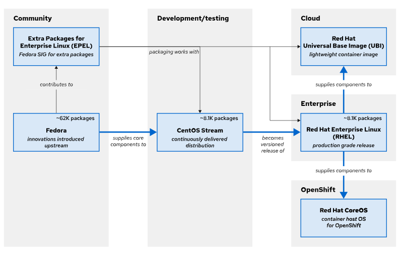
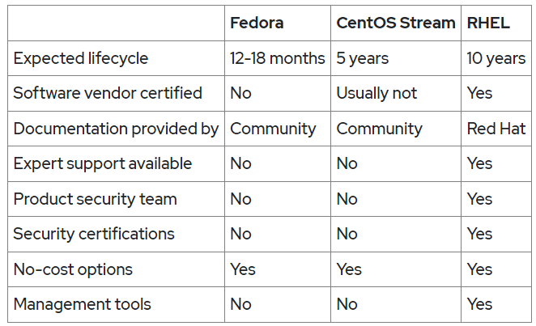
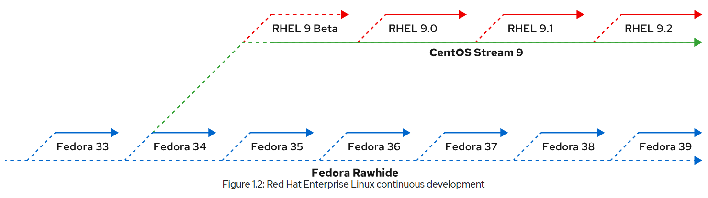

### Глава 1. Начало работы с Red Hat Enterprise Linux

##### Парагрф 1.1. Что такое Linux?

`Linux` - это важнейшая технология, которую должны понимать ИТ-специалисты.

Linux широко используется во всем мире. Пользователи Интернета ежедневно взаимодействуют с приложениями Linux и системами веб-серверов, просматривая Всемирную паутину и используя сайты электронной коммерции для покупки и продажи продуктов.

Linux используется не только в Интернете. Linux управляет системами торговых точек и мировыми фондовыми рынками, обеспечивает работу смарт-телевизоров и бортовых развлекательных систем, а также управляет большинством из 500 лучших суперкомпьютеров в мире. 

Linux предоставляет основные технологии, которые способствуют облачной революции, и инструменты для создания новейших поколений контейнерных приложений микросервисов, программных технологий хранения и решений для больших данных.

В современном центре обработки данных преобладающими операционными системами являются Linux и Microsoft Windows. Использование Linux продолжает расширяться на предприятиях, в облаках и на устройствах. Благодаря его широкому распространению у вас есть много причин изучить Linux:
+ Пользователю Windows необходимо взаимодействовать с системами и приложениями Linux.
+ При разработке приложений Linux обычно размещает приложение и среду его выполнения.
+ В облачных вычислениях как частные, так и общедоступные облачные экземпляры используют Linux в качестве операционной системы.
+ Мобильные приложения и устройства Интернета вещей (IoT) обычно работают на Linux.
+ При поиске новых возможностей карьерного роста в сфере ИТ навыки работы с Linux пользуются большим спросом.

«Что делает Linux таким замечательным?», у вас есть много ответов на выбор:
+ `Linux — это программное обеспечение с открытым исходным кодом` - Открытый исходный код означает, что вы можете видеть все, как работает программа или система. Вы также можете экспериментировать с изменениями и свободно делиться ими, чтобы их могли использовать другие. Модель с открытым исходным кодом означает, что улучшения легче вносить, что позволяет быстрее внедрять инновации.
+ `Linux предоставляет интерфейс командной строки (CLI) для легкого доступа и мощных сценариев` - Linux построен на основе базовой философии проектирования, согласно которой пользователи могут выполнять все задачи администрирования из CLI. Это упрощает автоматизацию, развертывание и подготовку, а также упрощает локальное и удаленное администрирование системы. В отличие от многих других операционных систем, эти возможности были заложены в архитектуру с самого начала и привели к простоте использования и стабильности.
+ `Linux — это модульная операционная система, предназначенная для простой замены или удаления компонентов` - Компоненты системы можно модернизировать и обновлять при необходимости. Система Linux может быть рабочей станцией общего назначения или специально минимизированным программным устройством.

Открытый исходный код имеет множество преимуществ для пользователя:
+ `Контроль` - посмотрите, что делает код, и улучшите его.
+ `Обучение` - изучайте реальный код и разрабатывайте больше полезных приложений.
+ `Безопасность` - проверяйте конфиденциальный код и исправляйте его даже без помощи первоначальных разработчиков.
+ `Стабильность` - положитесь на код, который сможет пережить потерю первоначального разработчика.

Два основных класса лицензий с открытым исходным кодом особенно важны:
+ `Лицензии с авторским правом` предназначены для поощрения сохранения кода с открытым исходным кодом.
+ `Разрешительные лицензии` предназначены для максимизации возможности повторного использования кода.

`Дистрибутив Linux` — это устанавливаемая операционная система, созданная на основе ядра Linux и поддерживающая пользовательские программы и библиотеки. Полная система Linux разрабатывается несколькими независимыми сообществами разработчиков, которые совместно работают над отдельными компонентами. Дистрибутив предоставляет простой способ установки и управления работающей системой Linux.

В 1991 году аспирант `Линус Торвальдс` разработал UNIX-подобное ядро, которое он назвал Linux, и лицензировал его как программное обеспечение с открытым исходным кодом под лицензией GPL. Ядро является ядром операционной системы и управляет оборудованием, памятью и планированием запуска программ. 

Ядро Linux дополнено другим программным обеспечением с открытым исходным кодом, включая утилиты и программы из проекта GNU Project, графический интерфейс из системы X Window MIT. Ядро Linux также включает в себя другие компоненты с открытым исходным кодом, такие как почтовый сервер Sendmail и веб-сервер Apache HTTP, чтобы стать полноценной UNIX-подобной операционной системой с открытым исходным кодом.

Основная задача для пользователей `Linux` — собрать все эти части программного обеспечения из многих источников. Ранние разработчики Linux предоставляли дистрибутив готовых и протестированных инструментов, которые пользователи могли загрузить и установить для быстрого внедрения систем Linux.

Существует множество дистрибутивов Linux, каждый из которых имеет разные цели и критерии поддержки. Как правило, дистрибутивы имеют некоторые общие характеристики:
+ `Дистрибутивы` состоят из ядра Linux и поддерживают программы пользовательского пространства.
+ `Дистрибутивы` могут быть небольшими и одноцелевыми или могут включать тысячи программ с открытым исходным кодом.
+ `Дистрибутивы` предоставляют средства для установки и обновления программного обеспечения и его компонентов.
+ `Поставщик` распространения поддерживает программное обеспечение и, в идеале, участвует в сообществе разработчиков.

`Red Hat Enterprise Linux (RHEL)` — это коммерческий дистрибутив Linux промышленного уровня от Red Hat. Red Hat разрабатывает и интегрирует программное обеспечение с открытым исходным кодом в RHEL посредством многоэтапного процесса.

##### Итог парагрфа 1.1:
+ Программное обеспечение с открытым исходным кодом имеет исходный код, который каждый может свободно использовать, изучать, изменять и делиться.
+ Дистрибутив Linux — это устанавливаемая операционная система, созданная на основе ядра Linux и поддерживающая пользовательские программы и библиотеки.
+ Red Hat участвует в поддержке и предоставлении кода для проектов с открытым исходным кодом; спонсирует и интегрирует программное обеспечение проекта в дистрибутивы, управляемые сообществом; и стабилизирует программное обеспечение, чтобы предлагать его в качестве поддерживаемых продуктов, готовых к использованию на предприятии.
+ Red Hat Enterprise Linux — это коммерчески поддерживаемый дистрибутив Linux с открытым исходным кодом, готовый для использования на предприятиях, который предоставляет Red Hat.
+ Бесплатная подписка Red Hat Developer Subscription — это полезный способ получения учебных ресурсов и информации, включая подписки разработчиков на Red Hat Enterprise Linux и другие продукты Red Hat.
